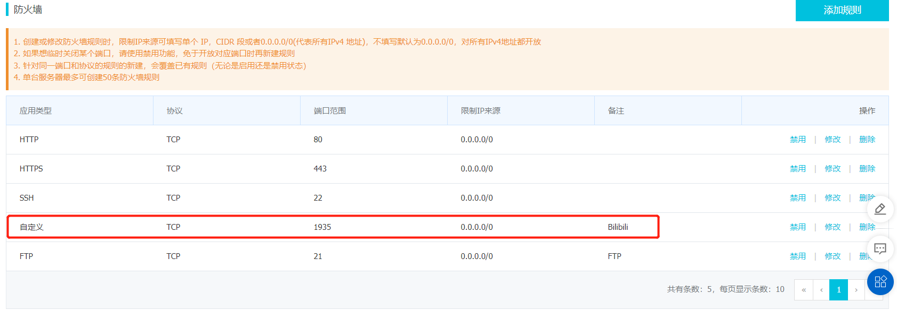

# Bilibili 24小时挂机直播教程
## 0 参考
参up主直播中华小当家的教程。

[zerokong的个人空间-哔哩哔哩](https://b23.tv/MfScS6T)

## 1 配置服务器防火墙
以阿里云轻量应用服务器 Ubuntu 20.04 为例。

在防火墙安全策略中开通一个端口，用来做rtmp推流的出口，以1935端口为例。



## 2 软件安装
```sh
#更新软件仓库
sudo apt update
#安装Nginx
sudo apt install nginx
#安装Nginx-rtmp模块
sudo apt install libnginx-mod-rtmp
#安装FFmpge
sudo apt install ffmpeg
```

## 3 配置nginx+rtmp推流

编辑nginx配置文件，加入rtmp服务器规则。

```sh
#配置Nginx
sudo vi /etc/nginx/nginx.conf
```

加入的配置信息如下，listen 1935表示使用1935端口，include为rtmp推流文件。

```conf
rtmp {
    server {
        listen 1935;
        chunk_size 10240;
        application live {
            live on;
            record off;
            include /etc/nginx/conf/push.conf;
        }
    }
}
```

打开Bilibili直播间网页，选择：我的直播间->开播设置，选择分区后，点击开播按钮。

此时，直播间已经打开，进入会看到等待中，也就是bilibili没有收到你的推流数据。

从此处开始，如果几分钟内还没有完成后续所有步骤，bilibili服务器长时间没有收到你的推流数据，直播间会被自动关闭。

选择rtmp直播，记录如下的地址和串流秘钥，重新开播时，秘钥可能发生变动，需要重新写文件。


随后将串流秘钥填写进推流文件。

```sh
sudo vi /etc/nginx/conf/push.conf
```

该文件格式为：(加号表示拼接，不写，结尾有一个英文分号)

```
push 上述服务器地址+串流秘钥;
```

完成配置后，确认nginx配置正确，重启nginx服务。

```sh
#检查Nginx配置
sudo nginx -t
#Nginx加载配置
sudo nginx -s reload
```

## 4 启动ffmpeg推流

使用ffmpeg推流到选取的端口，如果挂机需要使用nohup。

rtmp推流需要同时推视频和音频，只推音频则bilibili服务器无法接收只播出音频，因此播音主播需要为音频加封面，音画合成。

如果直播间被bilibili关闭，进程不会自动结束，服务器仍然通过端口不断发送推流数据。

所以如果b站直播间被举报关闭，重新开播后修改秘钥，打开直播间会直接恢复正常，无需重新启动ffmpeg推流。

视频进度保持在原来关闭直播间后继续推流的进度。如果同时运行两个推流进程，bilibili服务器解析时会发生数据冲突，看到错乱的视频。

租用的云服务器一般有网络流量上限，需要注意视频文件大小，虽然推流不是整个发送视频，但推流视频的流量消耗还是与视频单位时长的大小大致成正比。

### 4.1 单一视频

推流测试：

```sh
ffmpeg -re -stream_loop -1 -i /root/xxx.mp4 -c copy -f flv "rtmp://127.0.0.1:1935/live"
```

单视频循环：

```sh
nohup ffmpeg -loglevel quiet -re -stream_loop -1 -i /root/xxx.mp4 -c copy -f flv "rtmp://127.0.0.1:1935/live" 1>/dev/null 2>&1 &
```

### 4.2 视频列表循环
视频文件列表里写
```
file '/root/01.mp4'
file '/root/02.mp4'
```

推流测试：

```sh
ffmpeg -re -hide_banner -stream_loop -1 -f concat -safe 0 -i /视频文件列表 -c copy -f flv "rtmp://127.0.0.1:1935/live"
```

视频列表循环：

```sh
nohup ffmpeg -loglevel quiet -re -hide_banner -stream_loop -1 -f concat -safe 0 -i /视频文件列表 -c copy -f flv "rtmp://127.0.0.1:1935/live" 1>/dev/null 2>&1 &
```
